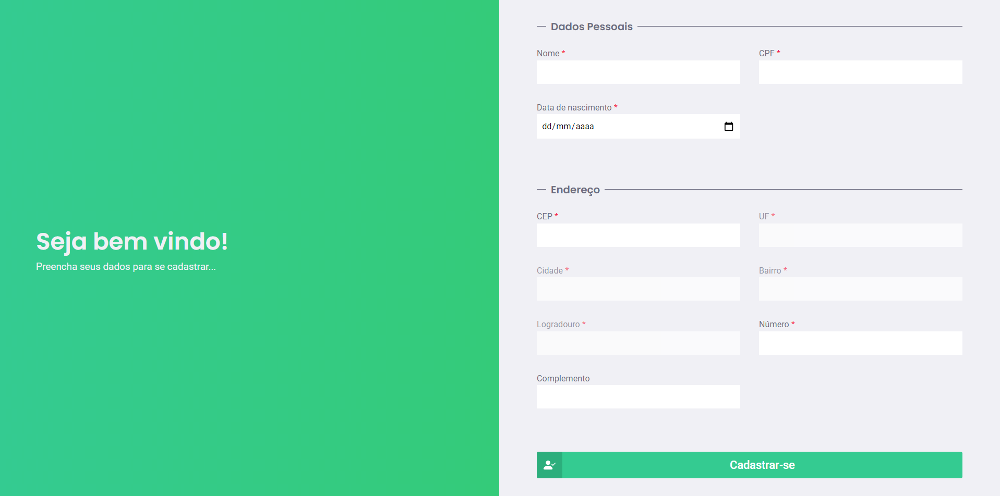
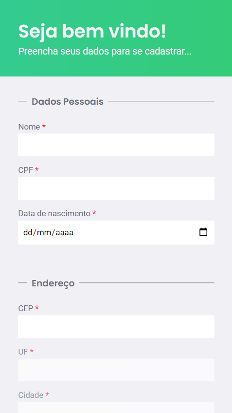

# Cadastro de Usuário - React JS

Este projeto foi criado utilizando [Create React App](https://github.com/facebook/create-react-app), afim de exibir uma tela responsiva que possui o cadastro de usuário com validação de campos. Os dados não se conectam a um banco de dados, apenas salva os mesmos no Local Storage.

## Dependências

Para iniciar o projeto é necessário ter instalado em sua máquina o [NodeJS](https://nodejs.org/pt-br/).

```bash
npm install
```

## Começando

Para iniciar o servidor, rode os seguintes comandos:

```bash
npm start
```

O servidor será iniciado http://localhost:3333/.

## Prints do projeto




